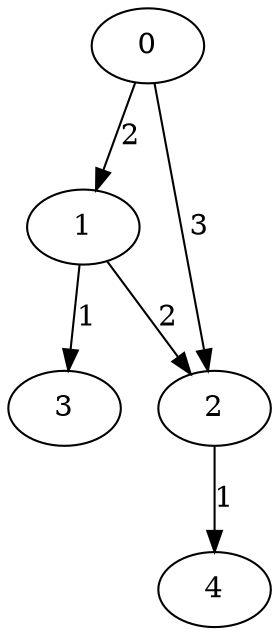

# Dijkstra — Labyrinthe

## Kurzbeschreibung

In dieser Aufgabe baust du eine Graphenstruktur auf und implementierst darauf zwei Analyseverfahren:

1. Ermittlung der **Zusammenhangskomponenten** (Connected Components) mithilfe von Breitensuche (BFS).
2. Finden eines **kürzesten Pfades** zwischen zwei Knoten mit **Dijkstra** (gewichteter, gerichteter Graph).

Das Ziel dieses READMEs ist, die Aufgabenstellung so zu dokumentieren, dass du die geforderten Klassen, Methoden, Logging-Anforderungen und Performance-Kriterien direkt in deinem GitHub-Projekt als `README.md` übernehmen kannst.

---

## Sprache / Erwartungen

* Sprache: **Java** (Nutze die Signaturen und Klassen im Template).
* Graph kann Schleifen (Knoten → sich selbst) und Mehrfachkanten speichern (Multigraph).
* IDs für Knoten sind aufsteigende Ganzzahlen ab `0` ohne Lücken.
* Logging: Für Dijkstra werden die Besuche und Nachbarn an das vorgegebene `Result`-Interface gemeldet — Details weiter unten.
* Die README beschreibt **nicht** Implementierungsstrategien (keine Lösungsrezepte), sondern Anforderungen, Schnittstellen und Beispiele.

---

## Erwartete Klassen & Methoden (Übersicht)

### Klasse `Graph`

Die Klasse stellt einen gerichteten, gewichteten Multigraphen bereit.

Erwartete / nützliche Methoden (Signaturen im Template beachten):

* `int addNode()`

  * Erstellt einen neuen Knoten und gibt dessen ID zurück. IDs beginnen bei `0` und steigen ohne Lücken.

* `void addEdge(int from, int to, int weight)`

  * Fügt eine gerichtete, gewichtete Kante von `from` nach `to` ein. Mehrfachkanten sind erlaubt.

* `void addBidirectionalEdge(int a, int b, int weight)`

  * Fügt zwei gerichtete Kanten (`a->b` und `b->a`) mit demselben Gewicht ein.

* `OptionalInt getShortestWeightBetweenNeighbours(int a, int b)`

  * Falls mindestens eine Kante von `a` nach `b` existiert, liefert die kleinste Gewichtssumme über alle direkten Kanten zwischen `a` und `b`. Ansonsten `OptionalInt.empty()`.

* `Collection<Integer> getAllNeighbours(int node)`

  * Liefert alle Nachbarn (Ziele) von `node`. Rückgabe als unveränderliche `Collection` (z. B. mit `Collections.unmodifiableCollection(...)`), Mehrfachnennungen sind zulässig, falls der Graph Mehrfachkanten hat.

* `int getNumberOfNodes()`

  * Anzahl aller Knoten im Graphen.

> Implementationswahl (Adjazenzliste, Kantenliste etc.) ist frei — achte auf Performance-Anforderungen der weiteren Aufgaben.

---

### Klasse `BFS`

Breitensuche für Single-Source-Shortest-Path in ungewichteten Graphen.

* `void sssp(Graph g, int start)`

  * Führt BFS vom Startknoten aus und speichert die Ergebnisse (Tiefe/Eltern) zur späteren Abfrage.

* `int getDepth(int node)`

  * Liefert die Knoten-Tiefe (Entfernung in Kanten) vom zuletzt ausgeführten `sssp`. Falls der Knoten nicht besucht wurde: `-1`.

* `int getParent(int node)`

  * Liefert den Elternknoten (Vorgänger) auf dem BFS-Baum. Falls nicht besucht: `-1`.

> Hinweis: `sssp` kann mehrfach auf demselben `BFS`-Objekt aufgerufen werden. Die Getter beziehen sich auf die **letzte** ausgeführte Suche — Verhalten für Abfragen zu früheren Durchläufen ist nicht definiert.

---

### Klasse `ConnectedComponents`

* `int countConnectedComponents(Graph g)`

  * Bestimmt die Anzahl der Zusammenhangskomponenten in einem **ungerichteten** Graphen (d. h. du wertest ggf. nur bidirektionale Kanten oder behandelst alle Kanten als ungerichtet). Verwende BFS (oder DFS) intern.

---

### Prioritätswarteschlange (Priority Queue)

Für Dijkstra brauchst du eine Prioritätswarteschlange. Du kannst

* die Java-Standardklasse `java.util.PriorityQueue` verwenden (erforderlichenfalls mit einer Hilfsklasse für Elemente/Schlüssel), **oder**
* eine eigene Implementierung (z. B. Binärheap) schreiben.

Die Wahl ist frei — die Tests prüfen nur das Verhalten und die Performance von Dijkstra insgesamt, nicht die konkrete PQ-Implementierung. Achte nur darauf, dass Einfügen / Extrahieren effizient sind.

---

### Klasse `Dijkstra`

Finde mit Dijkstra den kürzesten Pfad in einem gerichteten, gewichteten Graphen.

Erwartete / nützliche Methoden:

* `void findRoute(Graph g, int start, int target)`

  * Führt Dijkstra vom `start` zum `target` aus und speichert die Ergebnisse (Abstände, Vorgänger) intern. Wird nur einmal pro Objekt aufgerufen. Wenn kein Pfad existiert, wirf `NoSuchElementException`.

* `List<Integer> getShortestPath()`

  * Liefert die Knotenfolge vom Start zum Ziel (inklusive beider Endknoten) nach einem erfolgreichen `findRoute`. Falls kein Pfad vorhanden war, gebe eine leere Liste.

* `int getShortestPathLength()`

  * Liefert die Gesamtlänge (Summe der Gewichte) des gefundenen Pfades. Falls kein Pfad vorhanden war, Rückgabe `0` (oder wie im Template vorgegeben).

#### Logging-Anforderungen (wichtig)

Während `findRoute` muss an das gegebene `Result`-Interface geloggt werden:

* Jeder besuchte Knoten: `addNode(nodeId, currentDistance)` — stell sicher, dass Start- und Zielknoten geloggt werden.
* Für den aktuell verarbeiteten Knoten sollen seine Nachbarn geloggt werden:

  * `addNeighbour(neighbourId)` oder
  * `addNeighbours(Collection<Integer> neighbours)`
    Es ist nicht erforderlich, ob alle oder nur die bislang unbesuchten Nachbarn geloggt werden — beides ist zulässig.

Die Reihenfolge der Logeinträge soll sinnvoll den Dijkstra-Besuchen widerspiegeln (Startnode zuerst, dann Knoten in Besuchsreihenfolge, jeweils mit ihren Nachbarn).

---

## Beispiele (Graph & Beispiel-Logging)

**Graph (Graphviz):**



**Beispiel-Logging** (Start = 0, Ziel = 4 — mögliche korrekte Ausgabe):

```
Added node 0 with length 0
Added neighbour with id: 1
Added neighbour with id: 2
Added node 1 with length 2
Added neighbour with id: 2
Added neighbour with id: 3
Added node 3 with length 3
Added node 2 with length 3
Added neighbour with id: 4
Added node 4 with length 4
```

> Es ist zulässig, dass Knoten 2 und 3 in umgekehrter Reihenfolge besucht/geloggt werden; das ändert nichts an der Korrektheit.

---

## Performance-Anforderungen

* **BFS**

  * Graphen bis zu **400.000 Knoten** und **700.000 Kanten** müssen in ≤ **2 Sekunden** durchlaufen werden.

* **ConnectedComponents**

  * Graphen bis zu **250.000 Knoten**.

* **Dijkstra**

  * Graphen mit bis zu **200.000 Kanten** müssen innerhalb von **2 Sekunden** verarbeitet werden.

Achte bei der Wahl deiner internen Datenstrukturen (z. B. Adjazenzlisten, PriorityQueue) auf diese Anforderungen.

---

## Testfälle & Validierungsempfehlungen

1. **Graph-Grundfunktionen**

   * Füge Knoten hinzu, verifiziere IDs (0,1,2,...).
   * Füge gerichtete Kanten ein; teste `getAllNeighbours` (unmodifizierbare Collection).
   * Teste Mehrfachkanten und Schleifen → `getShortestWeightBetweenNeighbours` soll die kleinste direkte Kante zurückgeben.

2. **BFS**

   * Starte BFS an verschiedenen Quellen; prüfe `getDepth` und `getParent`.
   * Prüfe, dass nicht besuchte Knoten `-1` liefern.

3. **ConnectedComponents**

   * Baue mehrere ungerichtete Teilgraphen und verifiziere die korrekte Anzahl der Komponenten.

4. **Dijkstra**

   * Teste Fälle mit existierendem Pfad: `findRoute` → `getShortestPath` & `getShortestPathLength` geben erwartete Werte.
   * Teste nicht erreichbare Ziele: `findRoute` muss `NoSuchElementException` werfen; Getter geben Standardwerte (leer/0).
   * Prüfe Logging-Reihenfolge und dass Start- und Zielknoten geloggt wurden.

5. **Robustheit & Randfälle**

   * Leere Graphen, Einzelknoten, Kanten mit Gewicht 0, Kanten mit gleichen Gewichten, Zyklen.
   * Sehr große Graphen zur Performance-Messung.

---

## Randfälle / Hinweise (keine Lösungsrezepte)

* `getAllNeighbours` muss eine unveränderbare Collection liefern (z. B. mit `Collections.unmodifiableCollection`).
* Beim Speichern der BFS-/Dijkstra-Ergebnisse achte auf effiziente Repräsentation (Arrays/Lists statt teurer Maps, wenn Index-IDs verwendet werden).
* `findRoute` wird pro `Dijkstra`-Objekt nur einmal aufgerufen — du kannst interne Strukturen darauf abstimmen.
* Behandle nicht erreichbare Knoten/Fehlerfälle konsistent mit den Vorgaben (z. B. `-1`, `Optional.empty()`, `NoSuchElementException`).
